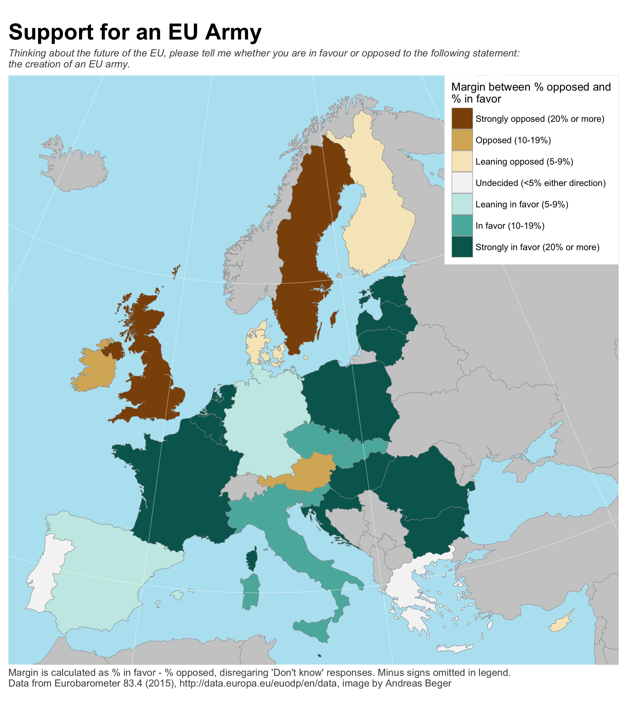
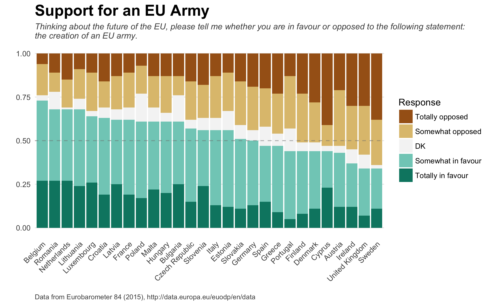
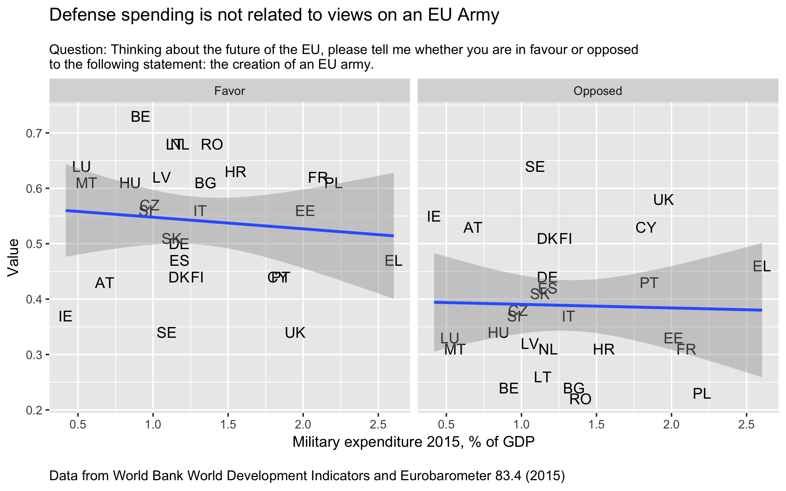

Plots of Eurobarometer EU Army support survey results
==========

[@andybeega](https://twitter.com/andybeega)

## Data sources

- Eurobarometer 84.3 (field work November 2015) from http://data.europa.eu/euodp/en/data/dataset/S2098_84_3_STD84_ENG
- Natural Earth 10 degree graticule http://www.naturalearthdata.com/downloads/50m-physical-vectors/50m-graticules/
- Map data from the `cshapes` R package. 
- Military spending from World Bank World Development Indicators at http://data.worldbank.org/indicator/MS.MIL.XPND.GD.ZS