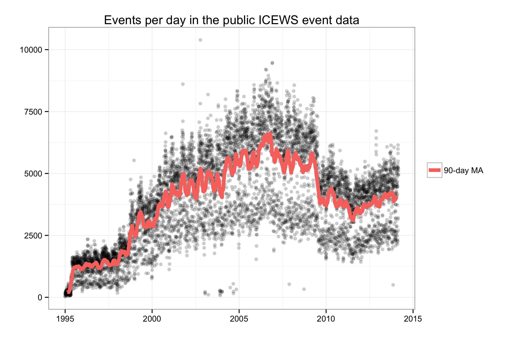
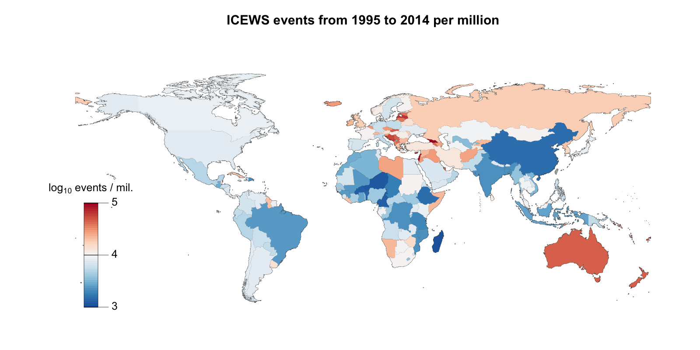

The ICEWS event data
==========

[@andybeega](https://twitter.com/andybeega)

This is a quick look at the public ICEWS data, including code for how to use the event data from R. David Masad has a much [better overview using Python](http://nbviewer.ipython.org/gist/dmasad/f79ce5abfd4fb61d253b).

The public ICEWS data are available on dataverse at [http://thedata.harvard.edu/dvn/dv/icews](http://thedata.harvard.edu/dvn/dv/icews).

The script in [`icews-to-public.r`](icews-to-public.r) has instructions for how to load the `.zip` files containing the event data into a SQLite database for further work in R. Further work with the data from there requires a bit of SQL. The script includes some really simple examples, but aggregating the raw event data to variables one might use in modeling requires a bit more complex queries. 

Events per day
------------

Total events by country, per million
-------------

The per capita event counts are log10, so the differences in the per capita counts in the map are actually much starker than they appear.

[`summary.r`](summary.r) has a bit more on this further down, including linear models with population among other predictors. 