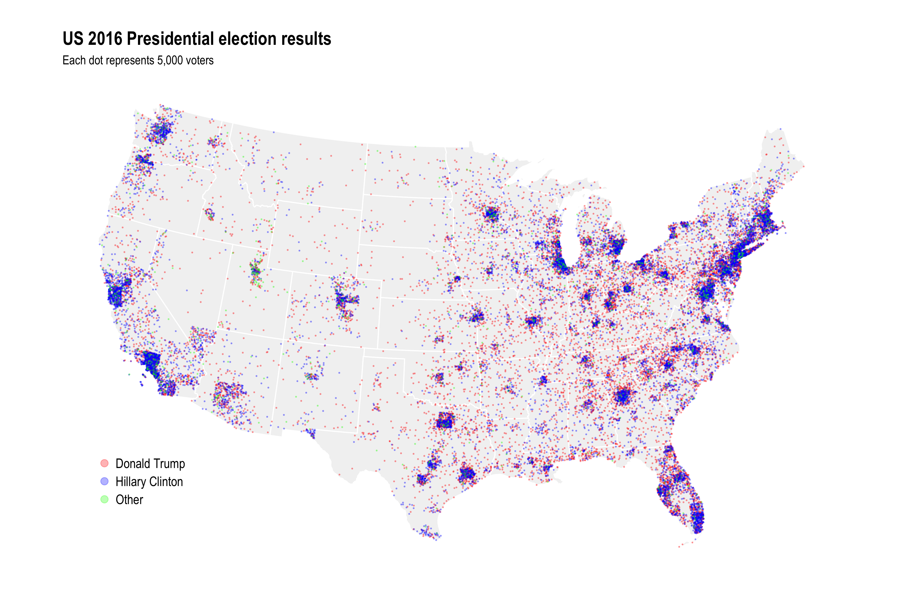

Dot density map of the 2016 election
================

Code for this blog post: <https://andybeger.com/2018/02/28/us-2016-dot-density/>



Generically, to make a dot density map in R:

``` r
suppressMessages({
  library("tidyverse")
  library("USAboundaries")
  library("sf")
})

# Modified version of sf:::st_sample that combines points by sampled polyon
st_sample_by_poly <- function(x, size) {
  x <- st_geometry(x)
  res <- lapply(1:length(x), function(i) {
    y <- st_poly_sample_n(x[i], size[i]) %>%
      st_combine()
    if (st_is_empty(y)) {
      y <- st_as_sfc("MULTIPOINT EMPTY")
    }
    y
  })
  do.call(c, res)
}

# Modified version of sf:::st_poly_sample that always returns correct size
# when sampling a polygon
st_poly_sample_n <- function(x, size) {
  stopifnot(length(x)==1)
  stopifnot(length(size)==1)
  x <- st_geometry(x)
  size <- round(size)
  if (size==0) {
    return(st_as_sfc("POINT EMPTY"))
  } else {
    pts <- st_sample(x, size)
    max_iter <- 10
    iter <- 1
    while(length(pts) < size & !(iter > max_iter)) {
      need <- size - length(pts)
      pts <- c(pts, st_sample(x, need))
      iter <- iter + 1
    }
    if (length(pts)==size) {
      return(pts)
    } else if (length(pts) > size) {
      return(pts[1:size])
    }
  }
}

lower48 <- us_states() %>%
  filter(!state_abbr %in% c("PR", "AK", "HI"))

lower48 <- lower48 %>%
  st_transform(crs = 102003) %>%
  mutate(n_dots = rpois(nrow(lower48), 10)) %>%
  mutate(n_dots = ifelse(state_abbr %in% c("FL", "WA"), 200, n_dots)) %>%
  mutate(dots = st_sample_by_poly(., size = n_dots))

ggplot() +
  geom_sf(data = lower48, fill = "gray50", color = "gray95") +
  geom_sf(data = st_set_geometry(lower48, lower48$dots))
```


Other dot resolutions
---------------------

With 10k votes per dot the county boundaries for places like LA are less prominent.


Doesn't look like the county level data works well with *more* dots, here a dot for each 1,000 votes:


