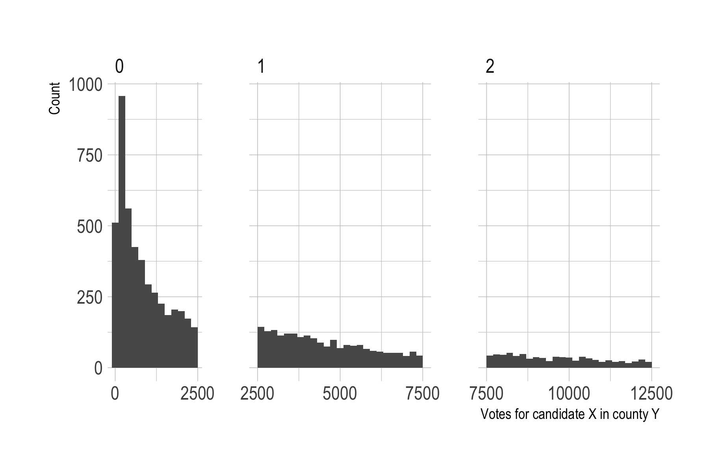

```{r setup, include=FALSE}
knitr::opts_chunk$set(echo = FALSE)

set.seed(43213)

library("tidyverse")
library("USAboundaries")
library("sf")
library("forcats")
library("hrbrthemes")
library("units")

# Modified version of sf:::st_sample that combines points by sampled polyon
st_sample_by_poly <- function(x, size) {
  x <- st_geometry(x)
  res <- lapply(1:length(x), function(i) {
    y <- st_poly_sample_n(x[i], size[i]) %>%
      st_combine()
    if (st_is_empty(y)) {
      y <- st_as_sfc("MULTIPOINT EMPTY")
    }
    y
  })
  do.call(c, res)
}

# Modified version of sf:::st_poly_sample that always returns correct size
# when sampling a polygon
st_poly_sample_n <- function(x, size) {
  stopifnot(length(x)==1)
  stopifnot(length(size)==1)
  x <- st_geometry(x)
  size <- round(size)
  if (size==0) {
    return(st_as_sfc("POINT EMPTY"))
  } else {
    pts <- st_sample(x, size)
    max_iter <- 10
    iter <- 1
    while(length(pts) < size & !(iter > max_iter)) {
      need <- size - length(pts)
      pts <- c(pts, st_sample(x, need))
      iter <- iter + 1
    }
    if (length(pts)==size) {
      return(pts)
    } else if (length(pts) > size) {
      return(pts[1:size])
    }
  }
}


if (!file.exists("us-2016-county-results.csv")) {
  votes_url <-"https://raw.githubusercontent.com/mkearney/presidential_election_county_results_2016/master/data/pres.elect16.results.2018.csv"
  download.file(votes_url, "us-2016-county-results.csv")
}

votes <- read_csv("us-2016-county-results.csv")

# add record for Oglala Lakota county
ol <- tibble(
  county = "Oglala Lakota",
  fips = "46102",
  cand = c("Hillary Clinton", "Donald Trump", "Gary Johnson", "Darrell L. Castle"),
  st = "SD", 
  pc_report = 1,
  votes = c(2510, 241, 106, 48),
  lead = NA_character_,
  pct = NA_real_,
  state.name = "South Dakota"
)
votes <- bind_rows(votes, ol)

votes_short <- votes %>%
  filter(!is.na(county)) %>%
  mutate(cand = cand %>% factor() %>% fct_other(keep = c("Hillary Clinton", "Donald Trump")),
         fips = as.numeric(fips)) %>%
  group_by(fips, cand) %>%
  summarize(votes = sum(votes)) 
  
lower48 <- us_counties() %>%
  mutate(fips = as.numeric(paste0(statefp, countyfp))) %>%
  st_transform(crs = 102003) %>%
  filter(!state_abbr %in% c("PR", "AK", "HI"))

county_cand <- lower48 %>% 
  left_join(votes_short, by = "fips")

mssng_county <- county_cand %>%
  filter(is.na(votes)) 

lower48_states <- lower48 %>%
  group_by(state_name) %>%
  summarize(statefp = unique(statefp)[1],
            state_abbr = unique(state_abbr)[1])

vals1 <- c("Donald Trump" = "red", "Hillary Clinton" = "blue",
           "Gary Johnson" = "yellow", "Jill Stein" = "green",
           "Other" = "green")
vals2 <- c("Donald Trump" = "red", "Hillary Clinton" = "blue",
           "Other" = "green")
```

```{r, include = FALSE}
county <- county_cand %>%
  mutate(area_km2 = st_area(st_geometry(.))/1e3^2) %>%
  st_set_geometry(NULL) %>%
  group_by(fips) %>%
  summarize(county_name = unique(name)[1],
            state_name = unique(state_name)[1],
            state_abbr = unique(state_abbr)[1],
            votes = sum(votes, na.rm = TRUE),
            area_km2 = unique(area_km2)[1]) %>%
  group_by(state_name) %>%
  mutate(state_votes = sum(votes)) %>%
  ungroup() %>%
  arrange(desc(votes))

state <- county %>%
  mutate(fips = floor(fips/1000)) %>%
  group_by(fips) %>%
  summarize(state_name = unique(state_name)[1],
            state_abbr = unique(state_abbr)[1],
            votes = sum(votes, na.rm = TRUE),
            area_km2 = sum(area_km2)) %>%
  arrange(votes)

state %>% 
  mutate(cum_votes = cumsum(votes), states = row_number()) %>%
  slice(1:which.min(abs(county$votes[1]-cum_votes)))
county %>% 
  arrange(votes) %>% 
  mutate(cum_votes = cumsum(votes), counties = row_number()) %>%
  slice(which.min(abs(county$votes[1]-cum_votes)))
state %>%
  mutate(voter_density = votes/area_km2) %>%
  arrange(voter_density) %>%
  mutate(cum_votes = cumsum(votes), states = row_number()) %>%
  slice(1:which.min(abs(county$votes[1]-cum_votes)))
```

*(Last updated on 2018-06-22 with pointilist version and reference to stochastic rounding.)*

There was a little war of maps after the 2016 election. A thematic map of the election results with states colored red or blue based on where the plurality of votes went, [like this one from Politico](https://www.politico.com/mapdata-2016/2016-election/results/map/president/), visually overstates the Republican vote share. This is even more evident with a map at the county level ([example from here](https://imgur.com/gallery/sX9GM)), which shows a sea of red containing scattered islands of a blue archipelago. 


The problem is that these maps depict area, not the density or number of voters, and critics pointed out that the islands of blue actually contain the majority of the US's population, voters, and economic strength. Concretely, consider this example: the county with the largest number of votes--LA county with 3.4 million votes--had as many votes as the smallest 9 states^[Wyoming, Vermont, DC, North Dakota, South Dakota, Delaware, Rhode Island, Montana, Idaho.] by the number of votes cast, combined. Or, if we are looking at counties instead, LA country had as many votes cast as the smallest 1,017 counties combined. Dot density maps are one way to address this kind of concern while keeping the spatial context a map provides. 

In any case, while the 2016 election is a little bit passé, figuring out how to make dot density maps in R is not (for me). Below are details on how to do this and several problems I encountered along the way. This map is the end result. Each dot in the map represents 5,000 votes for a candidate. The underlying data are at the county level, which comes out in the way some of the larger counties with lots of voters are shown. 

```{r plot-medium, cache = TRUE}
ppl_per_point <- 5e3 
voter_points <- county_cand %>%
  filter(!is.na(votes)) %>%
  mutate(points = st_sample_by_poly(., size = .$votes / ppl_per_point)) %>%
  mutate(county_geom = st_geometry(.)) %>%
  st_set_geometry(.$points)

# How many county-candidates are rounded down to 0 for point sampling?
#table((voter_points$votes / ppl_per_point) %>% round())

# Correction for round 0 counties
voters_dropped <- voter_points %>%
  st_geometry() %>%
  st_combine() %>%
  st_cast("POINT") %>%
  length() %>%
  `*`(ppl_per_point) %>%
  `-`(sum(county_cand$votes, na.rm=T), .) 

size <- voter_points$votes / ppl_per_point
size_int <- round(size)

p <- size[size_int==0]

#hist(replicate(1000, sum(p > runif(length(p)))))

adj <- ( voters_dropped/ppl_per_point ) / ( mean(p)*length(p) )
accept <- ( size*adj > runif(length(size)) )
for (i in 1:nrow(voter_points)) {
  if (size_int[i]==0 & accept[i]) {
    pt <- st_poly_sample_n(voter_points$county_geom[i], size = 1) %>%
      st_cast("MULTIPOINT")
    if (length(pt) > 0) voter_points$points[i] <- pt
  }
}
voter_points <- voter_points %>% 
  st_set_geometry(.$points)

p <- ggplot() +
  geom_sf(data = lower48_states, fill = "gray95", colour = "white", size = .5) +
  geom_sf(data = voter_points, aes(colour = cand), size = .2, 
          shape = 19, alpha = .3, show.legend = "point") +
  scale_colour_manual("", values = vals2) +
  theme_ipsum() +
  ggtitle("US 2016 Presidential election results",
          sub = sprintf("Each dot represents %s voters", 
                        formatC(ppl_per_point, format="d", big.mark=","))) +
  coord_sf(datum = NA) +
  theme(legend.position = c(.1, .2), 
        text = element_text(size = 16)) +
  guides(colour = guide_legend(override.aes = list(size = 3)))
ggsave(p, file = "us-2016-dot-density-medium.png", height = 8, width = 12)
```


*****

## Technical details

The data on votes at the county level are from Michael W. Kearney, at this [GitHub repo](https://github.com/mkearney/presidential_election_county_results_2016). There are no county level results for Alaska and Hawaii, so I will only focus on the lower 48 states. Corresponding shapefiles are from the [USAboundaries](https://cran.r-project.org/package=USAboundaries) package. 

The basis for generating the dots in the map is the `st_sample()` function in [sf](https://cran.r-project.org/package=sf). This samples random points on/in other simple features, i.e. polygons corresponding to counties in this case. The [doc page has some examples](https://r-spatial.github.io/sf/reference/st_sample.html) showing what it does. In principle, getting the data needed to produce a dot density map is as simple as calling this function on each county geometry with a size argument derived from a candidate's number of votes in that county. In practice there were a couple of hiccups. 

First, the version of `st_sample()` I am using^[All this was done with development versions of "sf" and "ggplot2" from GitHub; for "ggplot2" I know for sure that the last CRAN version, 2.2.1, does not include needed fixes for `geom_sf()` bugs.] returns raw points without aggregating them to the geometry they were sampled from. The input data look like this:

```{r}
county_cand %>% 
  as_tibble() %>% 
  st_as_sf() %>% 
  select(fips, name, cand, votes, geometry)
```

Meanwhile `st_sample(county_cand$geometry[1:2])` just returns a bunch of points rather than a single MULTIPOINT feature for each input county, e.g.:

```{r}
st_sample(county_cand$geometry[1:2], size = round(county_cand$votes/1e3))
```

This doesn't play nice with `dplyr`. Also, when no points are sampled, `st_sample()` returns a length 0 result rather than an empty point, which can cause problems down the road.

```{r}
st_sample(county_cand$geometry[1], size = 0)
```

To fix both of these issues I wrote a wrapper function that (1) combines the points sampled for each county into a single MULTIPOINT, and (2) returns an empty MULTIPOINT when no points are sampled:

```{r, echo = TRUE}
# Modified version of sf:::st_sample that combines points by sampled polyon
st_sample_by_poly <- function(x, size) {
  x <- st_geometry(x)
  res <- lapply(1:length(x), function(i) {
    y <- st_poly_sample_n(x[i], size[i]) %>%
      st_combine()
    if (st_is_empty(y)) {
      y <- st_as_sfc("MULTIPOINT EMPTY")
    }
    y
  })
  do.call(c, res)
}
```

Why does this function call `st_poly_sample_n()` rather than `st_sample()`? Because of the next issue...

At the time I'm writing this (27 February 2018), `st_sample()` for polygons works by sampling from a polygon's bounding box and then discarding points that fall outside the polygon. To correct for the potential shortfall in points it adjusts the input size argument based on the ratio of the polygon's area to the area of it's bounding box. The relevant code from `sf:::st_poly_sample()`, which is called from `st_sample()`, and where `x` is in the input geometry:

```r
a0 = st_area(st_make_grid(x, n = c(1, 1)))
a1 = sum(st_area(x))
if (is.finite(a0) && is.finite(a1) && a0 > a0 * 0 && a1 > a1 * 0) {
  size = round(size * a0/a1)
}
```

This correction should on average and with large enough size numbers give the correct number of points, since the original set of points are sampled randomly. But how many fall outside the polygon at any given draw will vary, and this is very noticeable with the large number of county-candidate pairs that only sample 1 or 2 points. I fixed this with a brute force wrapper function that will always return exactly the desired number of points:

```{r, echo = TRUE}
# Modified version of sf:::st_poly_sample that always returns correct size
# when sampling a polygon
st_poly_sample_n <- function(x, size) {
  stopifnot(length(x)==1)
  stopifnot(length(size)==1)
  x <- st_geometry(x)
  size <- round(size)
  if (size==0) {
    return(st_as_sfc("POINT EMPTY"))
  } else {
    pts <- st_sample(x, size)
    max_iter <- 10
    iter <- 1
    while(length(pts) < size & !(iter > max_iter)) {
      need <- size - length(pts)
      pts <- c(pts, st_sample(x, need))
      iter <- iter + 1
    }
    if (length(pts)==size) {
      return(pts)
    } else if (length(pts) > size) {
      return(pts[1:size])
    }
  }
}
```

Sidebrag: I managed to get this working without causing an infite `while` loop...possibly reflecting learning from past mistakes. 

At this point the code runs and one can make a map, maybe spend an inordinate amount of time messing with minor plot parameters. However, when comparing the number of voters implied by the number of dots (dots x 5000) with the actual total number of voters, there is a big discrepancy. Several million votes are missing.

The biggest factor in that were small county-candidate vote records. With 5,000 votes per dot, county-candidate pairs with less than 2,500 votes get rounded to a sample of 0 points. And there are a lot of such small vote records. 

```{r rounding-histogram}
p <- voter_points %>%
  filter(votes < 1.25e4) %>%
  mutate(bin = round(votes / ppl_per_point)) %>%
  ggplot(aes(x = votes)) + 
  geom_histogram(binwidth = 200) +
  scale_x_continuous(breaks = seq(0, 25000, 2500)) +
  facet_grid(. ~ bin, scales = "free_x", space = "free_x") +
  theme_ipsum() +
  labs(x = "Votes for candidate X in county Y", y = "Count")
ggsave(p, file = "rounding-error-hist.png", height = 4, width = 6)
```



```{r, include = FALSE}
voter_points %>% 
  filter(votes < 2500) %>% 
  st_set_geometry(NULL) %>% 
  summarize(county_candidate_pairs = n(), votes = sum(votes))
```

This histogram shows the smaller county-candidate pairs with less than 12,500, split into panels by how many dots we would sample for them at a resolution of 5,000 people per dot and with simple rounding to the closest multiple of 5,000. More than 4,500 county-candidate pairs representating 3.7 million votes end up being rounded to 0, with no dots sampled for them. 

To fix this I did another pass through the county-candidate data and for records that were rounded to 0 probabilistically sampled a single point depending on how many votes there were, i.e. candidate-county records with 2,500 votes were more likely to get a point than a pair with 500 votes. 

Actually doing this with probabilities of \(P=\textrm{Votes} / 5000\) if Votes < 2,500, while technically correct as far as I can tell, would in practice push us back too far and create too many new dots than we need to make up for the total vote/dot shortfall. The reason, I think but haven't verified, is because I'm already oversampling within each bin. For example, for observations that get rounded to 1 dot, there are more towards the lower end of 2,500 than the upper end of 7,500, meaning that the bin as a whole will end up with too many dots. And although it's hard to tell in the plot for the bin for 2, that's a problem in all bins. So technically the sampling throughout should not use rounding but rather be probabilistic in some fashion. E.g. give a record with 7,500 votes 1 or 2 dots with equal probability of 0.5. 

I didn't do that. Since most of the problem is at the very low end with rounding to 0, fixing those gives results that are correct enough, as a table comparing vote and dot shares for each candidate shows. 

```{r table-vote-dot-share, results='asis'}
# How many points for each candidate?
voter_points %>%
  group_by(cand) %>%
  st_set_geometry(NULL) %>%
  summarize(Votes = sum(votes),
            Dots = points %>% st_combine() %>% st_cast("POINT") %>% length()) %>%
  ungroup() %>%
  rename(Candidate = cand) %>%
  mutate(Vote_share = Votes / sum(Votes)*100,
         Dot_share = Dots / sum(Dots)*100) %>%
  knitr::kable(digits = 1, format.args = list(big.mark = ","))
```

Close enough. For good measure, here is the rounding error for different votes per dot resolutions, along with the actual average vote miscount after the round to 0 correction.

```{r rounding-error, include = FALSE}
# Rounding error against binning number
x <- c(1:10*1e3)
n_pts <- sapply(x, function(x) sum(round(county_cand$votes / x), na.rm=T))
pts_by_county <- round(county_cand$votes %*% t((1/x)))
implied_voters <- sweep(pts_by_county, MARGIN = 2, x, `*`)
round_error <- colSums(sweep(implied_voters, MARGIN = 1, county_cand$votes, `-`),
                       na.rm = TRUE) * -1

dots <- rep(0, nrow(voter_points))
for (i in 1:nrow(voter_points)) {
  dots[i] <- voter_points$points[i] %>% st_cast("POINT") %>% length()
}
implied_votes <- dots * ppl_per_point
round_error_w_correction <- sum(implied_votes - voter_points$votes)

png("round-error-vs-dot-resolution.png", height = 400, width = 600)
plot(n_pts, round_error, ylim = c(0, 6e6), xlim = c(0, 150000),
     xlab = "Points that will be on the map", ylab = "Observed vote total - votes implied by dots")
title(main = "Votes per dot and rounding error")
text(n_pts, round_error, labels = x, pos = 4)
points(x = sum(dots), y = round_error_w_correction, pch = 4)
text(x = sum(dots), y = round_error_w_correction, labels = "5000, with round 0 correction", pos = 4)
abline(lty = 3, col = "gray50", h = 0)
dev.off()
```


*Update 2018-06-22: I learned while making the pointilist version below that a general solution for this kind of rounding issue is to use stochastic rounding instead of regular, deterministic, rounding. A function implementing this in R is on the GitHub page for this post, with the other code.*

Code for making do density maps with R and for the 2016 election map in this post is
[on GitHub here](https://github.com/andybega/mireg-blogs/tree/master/us-2016-dot-density).

```{r plot-rough, eval = FALSE}
ppl_per_point <- 1e4
voter_points <- county_cand %>%
  filter(!is.na(votes)) %>%
  mutate(points = st_sample_by_poly(., size = .$votes / ppl_per_point)) %>%
  mutate(county_geom = st_geometry(.)) %>%
  st_set_geometry(.$points)

# How many voters are dropped given the current number of points?:
voters_dropped <- voter_points %>%
  st_geometry() %>%
  st_combine() %>%
  st_cast("POINT") %>%
  length() %>%
  `*`(ppl_per_point) %>%
  `-`(sum(county_cand$votes, na.rm=T), .) 
voters_dropped 

# Randomly sample 1 point for county-candidates that round to 0, with probability
# equal to votes / people_per_point. Otherwise we loose mostly rural areas with
# low population, which may have voted more for Trump.
size <- voter_points$votes / ppl_per_point
size_int <- round(size)

# How many points will we add?
p <- size[size_int==0]
hist(replicate(1000, sum(p > runif(length(p)))))
# That's too much, we end up adding more points than we should. Manually adjust
# given how many points we are missing. 
adj <- ( voters_dropped/ppl_per_point ) / ( mean(p)*length(p) )
accept <- ( size*adj > runif(length(size)) )
for (i in 1:nrow(voter_points)) {
  if (size_int[i]==0 & accept[i]) {
    pt <- st_poly_sample_n(voter_points$county_geom[i], size = 1) %>%
      st_cast("MULTIPOINT")
    if (length(pt) > 0) voter_points$points[i] <- pt
  }
}
voter_points <- voter_points %>% 
  st_set_geometry(.$points)

voter_points %>%
  st_geometry() %>%
  st_combine() %>%
  st_cast("POINT") %>%
  length() %>%
  `*`(ppl_per_point) %>%
  `-`(sum(county_cand$votes, na.rm=T), .) 

#plot(voter_points[, "cand"])
#plot(voter_points$county_geom, add = T)

#county_cand %>% st_set_geometry(NULL) %>% filter(votes < .5e4) %>% group_by(cand) %>% summarize(votes = sum(votes))
#county_cand %>% st_set_geometry(NULL) %>% filter(votes < .5e3) %>% group_by(cand) %>% summarize(votes = sum(votes))

p <- ggplot() +
  geom_sf(data = lower48_states, fill = "gray95", colour = "white", size = .5) +
  geom_sf(data = voter_points, aes(colour = cand), size = .2, 
          shape = 19, alpha = .4, show.legend = "point") +
  scale_colour_manual("", values = vals2) +
  theme_ipsum() +
  ggtitle("US 2016 Presidential election results",
          sub = sprintf("Each dot represents %s voters", 
                        formatC(ppl_per_point, format="d", big.mark=","))) +
  coord_sf(datum = NA) +
  theme(legend.position = c(.1, .2), 
        text = element_text(size = 16))  +
  guides(colour = guide_legend(override.aes = list(size = 3)))
ggsave(p, file = "us-2016-dot-density-rough.png", height = 8, width = 12)
```


```{r, eval = FALSE}
ppl_per_point3 <- 1e3
voter_points3 <- county_cand %>%
  filter(!is.na(votes)) %>%
  mutate(points = st_sample_by_poly(., size = .$votes / ppl_per_point)) %>%
  mutate(county_geom = st_geometry(.)) %>%
  st_set_geometry(.$points)

p3 <- ggplot() +
  geom_sf(data = lower48_states, fill = "gray95", colour = "white", size = .5) +
  geom_sf(data = voter_points3, aes(colour = cand), size = .01, 
          shape = 19, alpha = .2, show.legend = "point") +
  scale_colour_manual("", values = vals2) +
  theme_ipsum() +
  ggtitle("US 2016 Presidential election results",
          sub = sprintf("Each dot represents %s voters", 
                        formatC(ppl_per_point3, format="d", big.mark=","))) +
  coord_sf(datum = NA) +
  theme(legend.position = c(.1, .2), 
        text = element_text(size = 16))  +
  guides(colour = guide_legend(override.aes = list(size = 3)))
ggsave(p3, file = "us-2016-dot-density-fine.png", height = 8, width = 12)
```

## Addendum: pointilist map

Lastly, here is a pointilist version in the style of [Rankin's French kissing map](http://www.radicalcartography.net/index.html?frenchkisses). This does away with the "each dot is X people" mapping. Instead, the number of dots for a candidate in a county are based on their vote share and the county area. Thus the point density overall is more or less uniform over space. 

```{r pointilism}
county_cand2 <-  votes %>%
  filter(!is.na(county)) %>%
  mutate(cand = cand %>% factor() %>% 
           #fct_other(keep = c("Hillary Clinton", "Donald Trump", "Gary Johnson", "Jill Stein")),
           fct_other(keep = c("Hillary Clinton", "Donald Trump")),
         fips = as.numeric(fips)) %>%
  group_by(fips, cand) %>%
  summarize(votes = sum(votes)) %>%
  left_join(lower48, ., by = "fips")

# adapted from http://coleoguy.blogspot.com.ee/2016/04/stochasticprobabilistic-rounding.html
stochastic_round = function(x){
  ## extract the decimal portion
  q = abs(x - trunc(x))
  
  ## draw a value 0 or 1 with probability
  ## based on how close we already are
  adj = rbinom(n = length(x), size = 1, prob = q)
  
  ## make it negative if x is
  adj <- ifelse(x < 0, adj * -1, adj)
  
  ## return our new value
  trunc(x) + adj
}


voter_points2 <- county_cand2 %>%
  filter(!is.na(votes)) %>%
  dplyr::mutate(area_km2 = st_area(st_geometry(.)) / 
                  (1e6 * with(ud_units, m^2)) * (1 * with(ud_units, km^2))
  ) %>%
  dplyr::group_by(fips) %>%
  dplyr::mutate(county_votes = sum(votes)) %>%
  dplyr::ungroup() %>%
  mutate(vote_share = votes / county_votes,
         cand_points = stochastic_round(vote_share * as.numeric(area_km2) / 50))

voter_points2 <- voter_points2 %>%
  mutate(points = st_sample_by_poly(., size = cand_points)) %>%
  mutate(county_geom = st_geometry(.)) %>%
  st_set_geometry(.$points)

p <- ggplot() +
  geom_sf(data = lower48_states, fill = "gray95", colour = "white", size = .5) +
  geom_sf(data = voter_points2, aes(colour = cand), size = .2, 
          shape = 19, alpha = .5, show.legend = "point") +
  scale_colour_manual("", values = vals1) +
  ggtitle("US 2016 Presidential election results",
          sub = "Pointilist variant à la Rankin") +
  labs(caption = "Andreas Beger\nVote data from Michael W. Kearney \nhttps://github.com/mkearney/presidential_election_county_results_2016") +
  coord_sf(datum = NA) +
  guides(colour = guide_legend(override.aes = list(size = 3))) +
  theme_ipsum() +
  theme(legend.position = c(.1, .2), 
        text = element_text(size = 16)) 
ggsave(p, file = "us-2016-pointilist-map.png", height = 8, width = 11)
```

