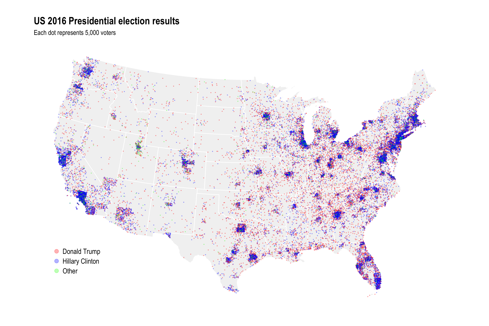
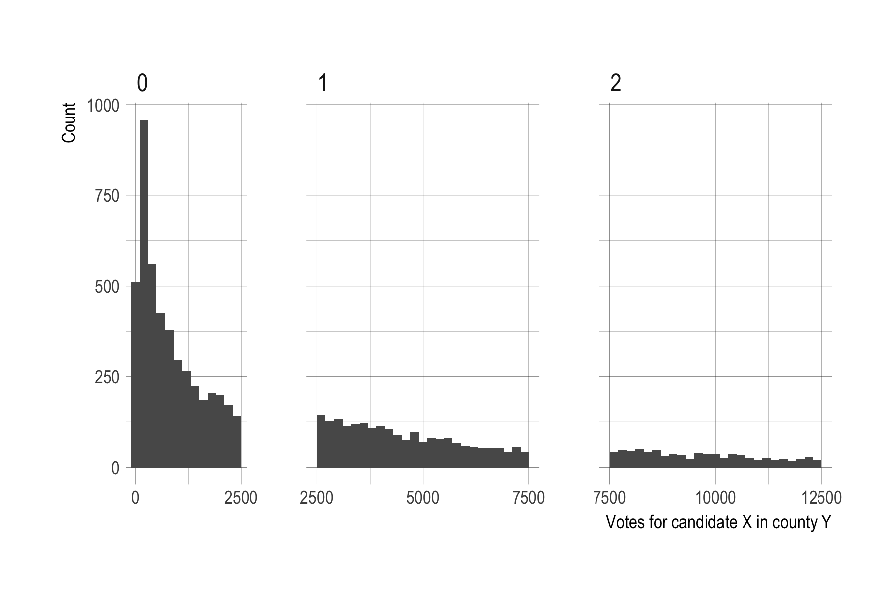
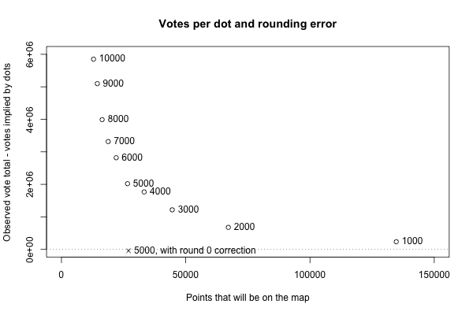

Untitled
================

*Subtitle: It is hard to do dot density maps of people in the US because so many people live in the big cities and so few people live in the vast land between them.*[1]

There was a little war of maps after the 2016 election. A typical thematic map of the election results with states colored red or blue based on where the plurality of votes went, [like this one from Politico](https://www.politico.com/mapdata-2016/2016-election/results/map/president/), visually overstates the Republican vote share. This is even more evident with a map at the county level ([example](https://imgur.com/gallery/sX9GM)), which shows a sea of red containing scattered islands of the blue archipelago.

The problem is that these maps depict area, not the density or number of voters, and critics pointed out that the islands of blue actually contain the majority of the US's population, voters, and economic strength. Concretely, consider this example: the county with the largest number of votes--LA county with 3.4 million votes--had as many votes as the smallest 9 states[2] by the number of votes cast, combined. Or, if we are looking at counties instead, as many as the smallest 1,017 counties combined. Dot density maps are one way to address this kind of concern while keeping the spatial context a map provides.

In any case, while the 2016 election is a little bit passé, figuring out how to make dot density maps in R is not (for me). The map below is the end result. Each dot in the map represents 5,000 votes for a candidate. The underlying data are at the county level which can be seen for the larger counties that have so many votes/dots that their shape is visible.



------------------------------------------------------------------------

Technical details
=================

The data on votes at the county level are from Michael W. Kearney, at this [github repo](https://github.com/mkearney/presidential_election_county_results_2016). There are no county level results for Alaska and Hawaii, so I will only focus on the lower 48 states. Corresponding shapefiles are from the [USAboundaries](https://cran.r-project.org/package=USAboundaries) package.

The basis for generating the dots in the map is the `st_sample()` function in [sf](https://cran.r-project.org/package=sf). This samples random points on/in other simple features, i.e. polygons corresponding to counties in this case. The [doc page has some examples](https://r-spatial.github.io/sf/reference/st_sample.html) showing what it does. In principle, getting the data needed to produce a dot density map is as simple as calling this function on each county geometry with a size argument derived from a candidate's number of votes in that county. In practice there were a couple of hiccups.

First, the version of `st_sample()` I am using[3] returns raw points without aggregating them to the geometry they were sampled from. The input data look like this:

    ## Simple feature collection with 9322 features and 4 fields
    ## geometry type:  MULTIPOLYGON
    ## dimension:      XY
    ## bbox:           xmin: -2356114 ymin: -1338125 xmax: 2258154 ymax: 1558935
    ## epsg (SRID):    102003
    ## proj4string:    +proj=aea +lat_1=29.5 +lat_2=45.5 +lat_0=37.5 +lon_0=-96 +x_0=0 +y_0=0 +datum=NAD83 +units=m +no_defs
    ## # A tibble: 9,322 x 5
    ##      fips name       cand            votes                       geometry
    ##     <dbl> <chr>      <fct>           <int>              <sf_geometry [m]>
    ##  1 39131. Pike       Donald Trump     7902 MULTIPOLYGON (((1078953 262...
    ##  2 39131. Pike       Hillary Clinton  3539 MULTIPOLYGON (((1078953 262...
    ##  3 39131. Pike       Other             424 MULTIPOLYGON (((1078953 262...
    ##  4 46003. Aurora     Donald Trump      974 MULTIPOLYGON (((-224564.9 7...
    ##  5 46003. Aurora     Hillary Clinton   340 MULTIPOLYGON (((-224564.9 7...
    ##  6 46003. Aurora     Other              93 MULTIPOLYGON (((-224564.9 7...
    ##  7 55035. Eau Claire Donald Trump    23331 MULTIPOLYGON (((343111 8307...
    ##  8 55035. Eau Claire Hillary Clinton 27340 MULTIPOLYGON (((343111 8307...
    ##  9 55035. Eau Claire Other            3512 MULTIPOLYGON (((343111 8307...
    ## 10 48259. Kendall    Donald Trump    15700 MULTIPOLYGON (((-280936 -81...
    ## # ... with 9,312 more rows

Meanwhile `st_sample(county_cand$geometry[1:2])` just returns a bunch of points rather than a single MULTIPOINT feature for each input county, e.g.:

    ## Geometry set for 12 features 
    ## geometry type:  POINT
    ## dimension:      XY
    ## bbox:           xmin: 1083436 ymin: 240184.1 xmax: 1126530 ymax: 263730.7
    ## epsg (SRID):    102003
    ## proj4string:    +proj=aea +lat_1=29.5 +lat_2=45.5 +lat_0=37.5 +lon_0=-96 +x_0=0 +y_0=0 +datum=NAD83 +units=m +no_defs
    ## First 5 geometries:

    ## POINT (1115450 242359.8)

    ## POINT (1093416 257082.5)

    ## POINT (1123905 263730.7)

    ## POINT (1104259 243644.3)

    ## POINT (1126215 262114.4)

This doesn't play nice with `dplyr`. Also, when no points are sampled, `st_sample()` returns a length 0 result rather than an empty point, which can cause problems down the road.

    ## Geometry set for 0 features 
    ## bbox:           xmin: NA ymin: NA xmax: NA ymax: NA
    ## epsg (SRID):    102003
    ## proj4string:    +proj=aea +lat_1=29.5 +lat_2=45.5 +lat_0=37.5 +lon_0=-96 +x_0=0 +y_0=0 +datum=NAD83 +units=m +no_defs

To fix both of these issues I wrote a wrapper function that (1) combines the points sampled for each county into a single MULTIPOINT, and (2) returns an empty MULTIPOINT when no points are sampled:

``` r
# Modified version of sf:::st_sample that combines points by sampled polyon
st_sample_by_poly <- function(x, size) {
  x <- st_geometry(x)
  res <- lapply(1:length(x), function(i) {
    y <- st_poly_sample_n(x[i], size[i]) %>%
      st_combine()
    if (st_is_empty(y)) {
      y <- st_as_sfc("MULTIPOINT EMPTY")
    }
    y
  })
  do.call(c, res)
}
```

Why does this function call `st_poly_sample_n()` rather than `st_sample()`? Because of the next issue...

At the time I'm writing this (27 February 2018), `st_sample()` for polygons works by sampling from a polygon's bounding box and then discarding points that fall outside the polygon. To correct for the potential shortfall in points it adjusts the input size argument based on the ratio of the polygon's area to the area of it's bounding box. The relevant code from `sf:::st_poly_sample()`, which is called from `st_sample()`, and where `x` is in the input geometry:

``` r
a0 = st_area(st_make_grid(x, n = c(1, 1)))
a1 = sum(st_area(x))
if (is.finite(a0) && is.finite(a1) && a0 > a0 * 0 && a1 > a1 * 0) {
  size = round(size * a0/a1)
}
```

This correction should on average and with large enough size numbers give the correct number of points, since the original set of points are sampled randomly. But how many fall outside the polygon at any given draw will vary, and this is very noticeable with the large number of county-candidate pairs that only sample 1 or 2 points. I fixed this with a brute force wrapper function that will always return exactly the desired number of points:

``` r
# Modified version of sf:::st_poly_sample that always returns correct size
# when sampling a polygon
st_poly_sample_n <- function(x, size) {
  stopifnot(length(x)==1)
  stopifnot(length(size)==1)
  x <- st_geometry(x)
  size <- round(size)
  if (size==0) {
    return(st_as_sfc("POINT EMPTY"))
  } else {
    pts <- st_sample(x, size)
    max_iter <- 10
    iter <- 1
    while(length(pts) < size & !(iter > max_iter)) {
      need <- size - length(pts)
      pts <- c(pts, st_sample(x, need))
      iter <- iter + 1
    }
    if (length(pts)==size) {
      return(pts)
    } else if (length(pts) > size) {
      return(pts[1:size])
    }
  }
}
```

Sidebrag: I managed to get this working without causing an infite `while` loop...possibly reflecting learning from past mistakes.

At this point I thought all problems had been fixed and I could kick back and spend an inordinate amount of time messing with minor plot parameters. Alas, when I compared the number of votes implied by the number of sampled points in the first draft plot and the actual total number of votes, another problem became obvious: there were not nearly enough dots. Several million votes were missing!

The biggest factor in that were small county-candidate vote records. With 5,000 votes per dot, county-candidate pairs with less than 2,500 votes get rounded to a sample of 0 points. And there are a lot of such small vote records.



This histogram shows the smaller county-candidate pairs with less than 12,500, split into panels by how many dots we would sample for them at a resolution of 5,000 people per dot and with simple rounding to the closest multiple of 5,000. More than 4,500 county-candidate pairs representating 3.7 million votes end up being rounded to 0, with no dots sampled for them.

To fix this I did another pass through the county-candidate data and for records that were rounded to 0 probabilistically sampled a single point depending on how many votes there were, i.e. candidate-county records with 2,500 votes were more likely to get a point than a pair with 500 votes.

Actually doing this with probabilities of *P* = Votes/5000 if Votes &lt; 2,500, while technically correct as far as I can tell, would in practice push us back too far, creating too many new dots than we need to make up for the total vote/dot shortfall. The reason, I think but haven't verified, is because I'm already oversampling within each bin. For example, for observations that get rounded to 1 dot, there are more towards the lower end of 2,500 than the upper end of 7,500, meaning that the bin as a whole will end up with too many dots. And although it's hard to tell in the plot for the bin for 2, that's a problem in all bins. So technically the sampling throughout should not use rounding but rather be probabilistic in some fashion. E.g. give a record with 7,500 votes 1 or 2 dots with equal probability of 0.5.

I didn't do that. Since most of the problem is at the very low end with rounding to 0, fixing those gives results that are correct enough, as a table comparing vote and dot shares for each candidate shows.

| Candidate       |       Votes|    Dots|  Vote\_share|  Dot\_share|
|:----------------|-----------:|-------:|------------:|-----------:|
| Donald Trump    |  62,692,350|  12,597|         46.5|        46.7|
| Hillary Clinton |  65,467,661|  13,111|         48.5|        48.6|
| Other           |   6,790,718|   1,274|          5.0|         4.7|

Close enough. For good measure, here is the rounding error for different votes per dot resolutions, along with the actual average vote miscount after the round to 0 correction.



[Code on GitHub](https://www.github.com/andybega/mireg).

[1] At least with data that doesn't go deeper than the county level.

[2] Wyoming, Vermont, DC, North Dakota, South Dakota, Delaware, Rhode Island, Montana, Idaho.

[3] All this was done with development versions of "sf" and "ggplot2" from GitHub; for "ggplot2" I know for sure that the last CRAN version, 2.2.1, does not include needed fixes for `geom_sf()` bugs.
